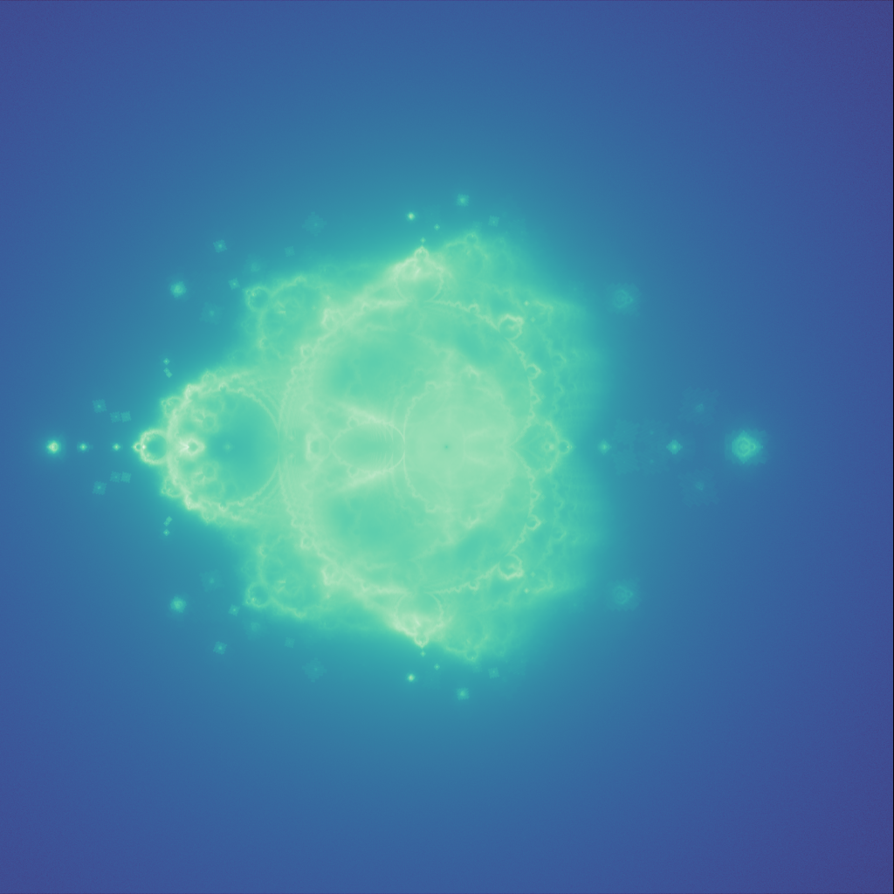

# Buddhabrot CPP
Multi-threaded Buddhabrot renderer written in C++.

## Fractal
The buddhabrot fractal is rendered using the same iterated function as the Mandelbrot function.
For each iterated point that eventually does escape, the count at each pixel visited along is incremented.
The final image is produced by visualizing these counts.

I've chosen to visualize the counts using on a log scale with perceptually uniform colormaps, as I believe this shows the detail in the image best.

### Optimization technique
Since only points that eventually escape are counted, and points which take many iterations to escape contribute much more to the final image, sampling
points close to the edge of the Mandelbrot yield a more detailed image for the same amount of points and iterations. These points are selected by rendering
the regular Mandelbrot set, and selecting only points close to the edge using morphological image processing techniques.

## Images

*Note: square artifacts are due to the optimization technique used* 
